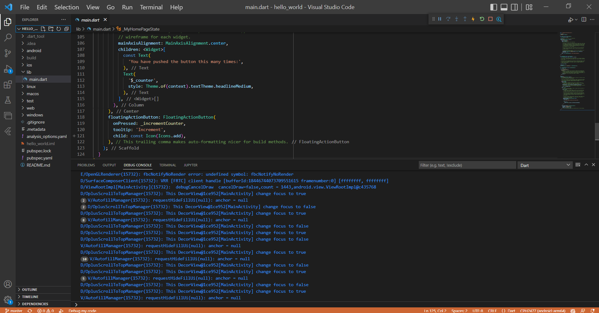
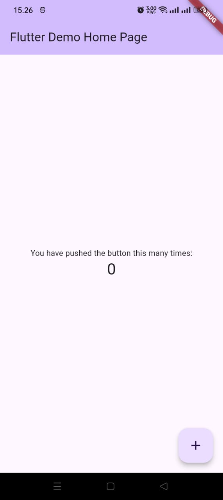
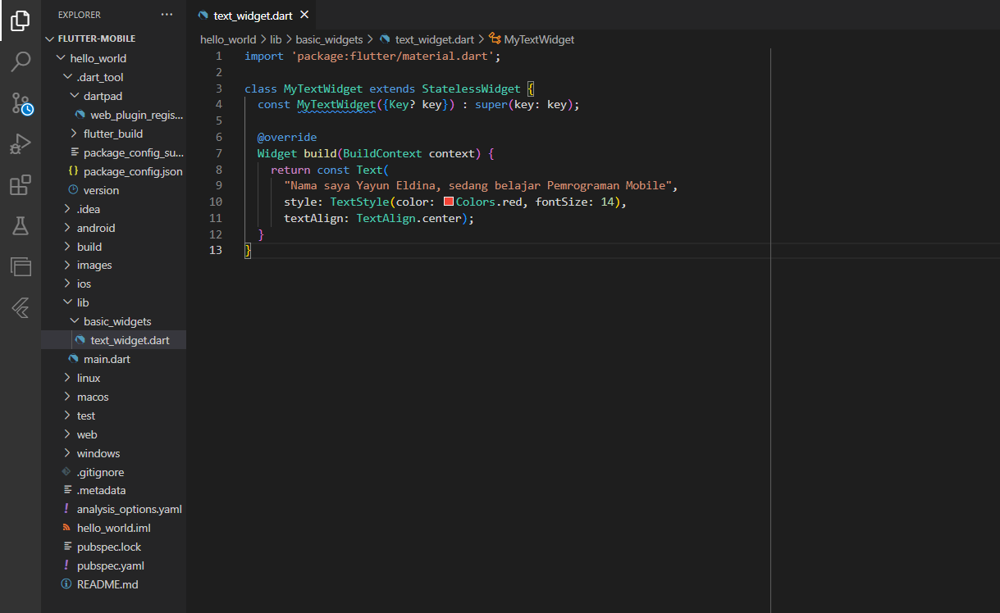
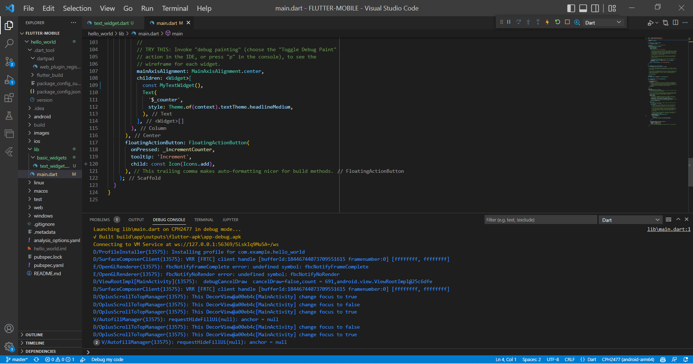
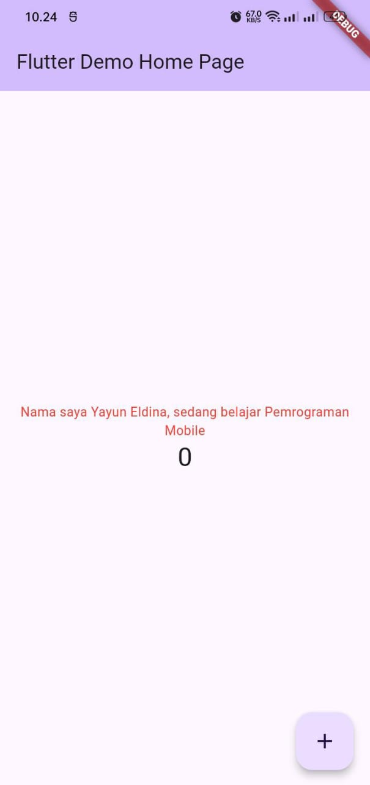
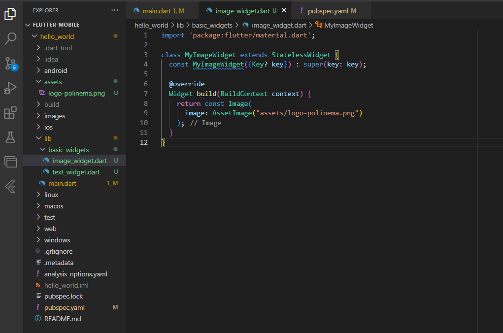
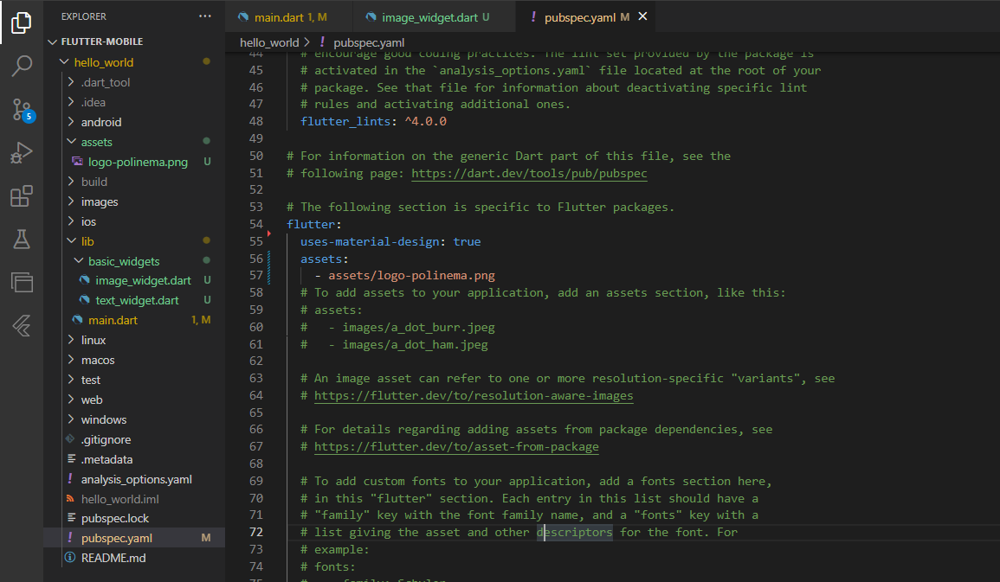
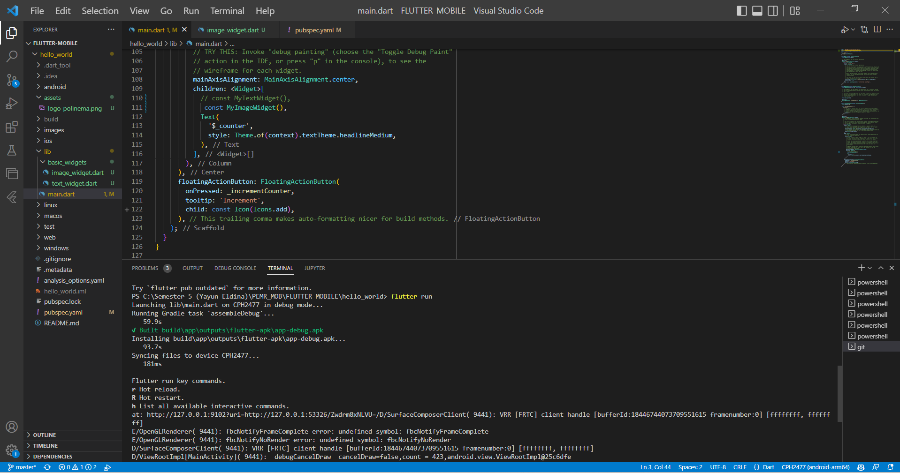
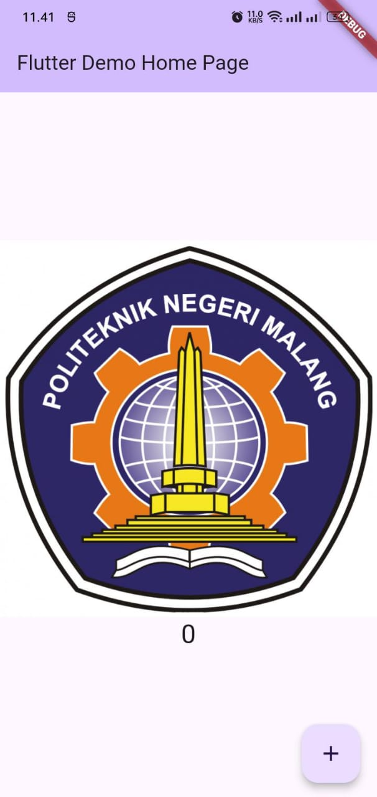

# hello_world
# Jobsheet 05 | Aplikasi Pertama dan Widget Dasar Flutter

## **Nama      : Yayun Eldina**
## **NIM     : 2241720065**
## **Kelas     : TI-3F**

---

A new Flutter project.

Tampilan pada handphone

# **Praktikum 4 : Menerapkan Widget Dasar**
## **Langkah 1 : Text Widget**
* Buat folder baru basic_widgets di dalam folder lib. Kemudian buat file baru di dalam basic_widgets dengan nama text_widget.dart. Ketik atau salin kode program berikut ke project hello_world Anda pada file text_widget.dart.

* Lakukan import file text_widget.dart ke main.dart, lalu ganti bagian text widget dengan kode di atas. Maka hasilnya seperti gambar berikut. Screenshot hasil milik Anda, lalu dibuat laporan pada file README.md.

## **Langkah 2 : Image Widget**
* Buat sebuah file image_widget.dart di dalam folder basic_widgets dengan isi kode berikut.

* Lakukan penyesuaian asset pada file pubspec.yaml dan tambahkan file logo Anda di folder assets project hello_world.

* Jangan lupa sesuaikan kode dan import di file main.dart kemudian akan tampil gambar seperti berikut.

